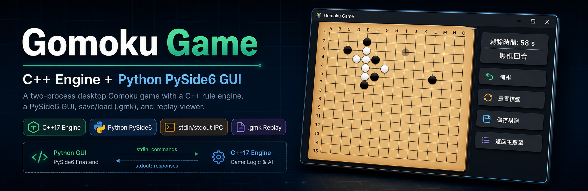
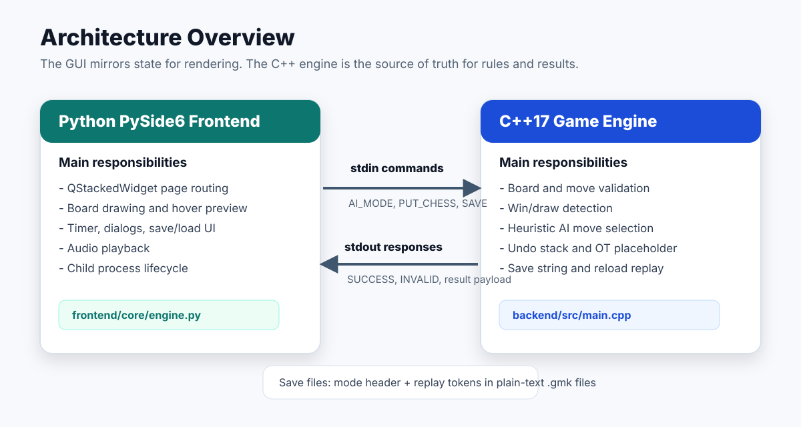
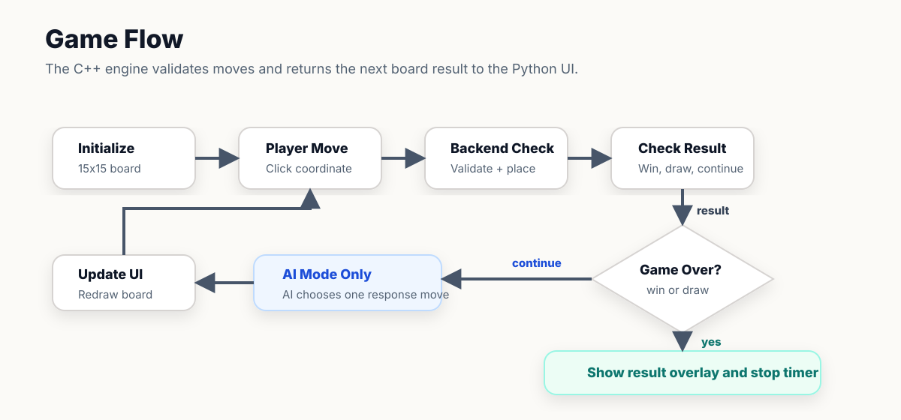
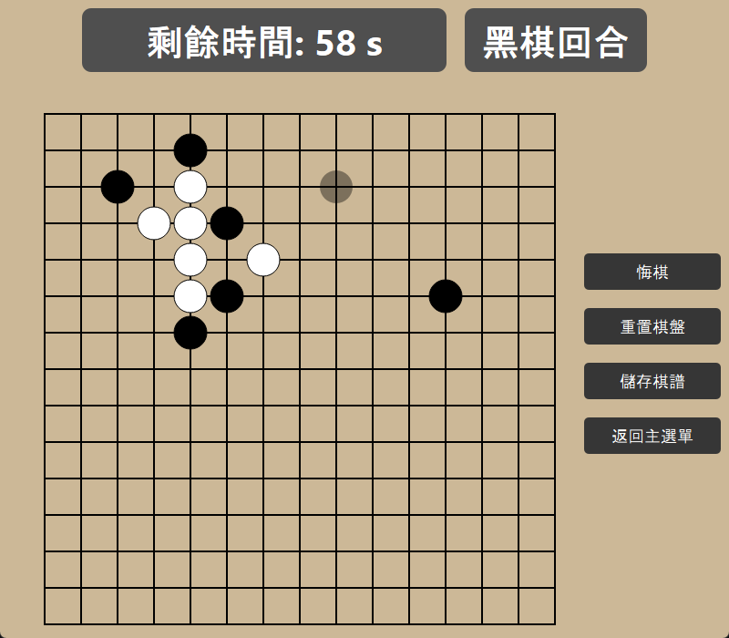
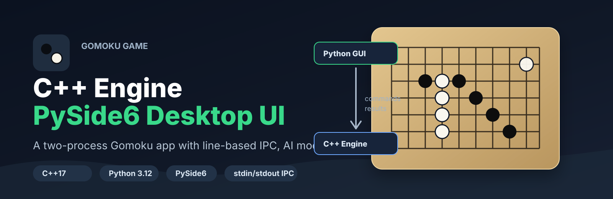

# Gomoku Game



A desktop Gomoku game built with a C++17 rule engine and a Python PySide6 graphical interface. The project separates game logic from presentation: the backend process owns the board state, rule validation, AI moves, undo history, and replay string, while the frontend renders the interface and communicates with the engine through a small line-based stdin/stdout protocol.

This repository is suitable as a portfolio project because it demonstrates process communication, GUI event handling, game-state modeling, save/load design, and a clean boundary between C++ logic and Python UI code.

## Features

- 15x15 Gomoku board with black and white stones.
- Single-player mode against a C++ heuristic AI.
- Local two-player mode on the same machine.
- Move validation for out-of-bounds and occupied positions.
- Win detection across horizontal, vertical, and diagonal lines.
- Draw detection when the board is full.
- Optional undo, timer, and reset controls for new games.
- Overtime handling that records turn changes without placing a stone.
- Save and load support using `.gmk` replay files.
- Replay viewer with next-step and previous-step navigation.
- Hover preview for the next stone position.
- Result overlay with save and replay-copy actions.
- Background music and sound effects through Qt Multimedia.
- Basic GitHub Actions workflow is present for backend build and frontend checks. The Python dependency install step needs an update to match the current dependency files.

Current limitation: remote/network multiplayer is present in the UI as a planned mode, but the create/join room buttons currently open a work-in-progress dialog. No socket layer or remote game protocol is implemented yet.

## Tech Stack

| Layer | Technology | Purpose |
| --- | --- | --- |
| Backend | C++17, CMake | Board model, rules, AI, undo stack, save string, reload reconstruction |
| Frontend | Python 3.12, PySide6 | Desktop UI, routing, drawing, dialogs, audio, file picker |
| IPC | stdin/stdout text protocol | Communication between Python GUI and C++ engine process |
| CI | GitHub Actions | Intended backend build and frontend compile check |
| Save files | Plain-text `.gmk` files | Mode header plus replay token sequence |

## Architecture Overview



The frontend starts the compiled C++ executable with `subprocess.Popen` in `frontend/core/engine.py`. Each game action is sent as a command line, and the backend replies with `SUCCESS` or `INVALID` before any command-specific payload.

Example command flow for a single-player move:

```text
Python -> PUT_CHESS
C++    -> SUCCESS
Python -> 7 7
C++    -> SUCCESS CONTINUE 8 8
```

In AI mode, the payload includes the board result plus the AI response coordinate. In local two-player mode, the payload only includes the board result because no AI move is generated.

The backend state machine lives in `backend/src/main.cpp`:

1. Wait for a mode command such as `AI_MODE`, `TWO_PLAYER_MODE`, or `RELOAD_MODE`.
2. Create or rebuild a `GameManager`.
3. Enter the matching game loop.
4. Process actions such as `PUT_CHESS`, `TAKE_BACK`, `OVER_TIME`, `SAVE`, `RESET`, and `HOME_PAGE`.

The frontend page flow is coordinated by `MainWindow` and `Router` in `frontend/main.py` and `frontend/ui/navigation/router.py`. Game pages delegate backend communication to `GomokuEngine`, while UI components such as `GomokuBoard`, `GameTimerLabel`, and `BattleResult` handle drawing and interaction.

Mermaid source is also available in [docs/assets/architecture-diagram.mmd](docs/assets/architecture-diagram.mmd).

## Game Flow



Mermaid source is available in [docs/assets/game-flow-diagram.mmd](docs/assets/game-flow-diagram.mmd).

## Project Structure

```text
gomoku-game/
+-- backend/
|   +-- CMakeLists.txt
|   +-- include/
|   |   +-- board.h
|   |   +-- game_manager.h
|   |   +-- ai_player.h
|   |   +-- ...
|   +-- src/
|   |   +-- main.cpp
|   |   +-- game_manager.cpp
|   |   +-- board.cpp
|   |   +-- ai_player.cpp
|   |   +-- ...
+-- frontend/
|   +-- main.py
|   +-- pyproject.toml
|   +-- core/
|   |   +-- engine.py
|   +-- ui/
|   |   +-- components/
|   |   +-- navigation/
|   |   +-- pages/
|   +-- assets/
|   |   +-- audio/
+-- docs/
|   +-- assets/
|   +-- protocol.md
|   +-- save-format.md
|   +-- screenshot-plan.md
|   +-- ...
+-- README.md
```

## Installation

### Prerequisites

- CMake 3.10 or newer.
- A C++17-capable compiler.
- Python 3.12.
- PySide6.

This project currently stores frontend dependencies in `frontend/pyproject.toml` and `frontend/uv.lock`.

### 1. Build the C++ backend

From the repository root:

```bash
cmake -B backend/build -S backend
cmake --build backend/build --config Release
```

On Unix-like systems where `backend/build` already contains a Makefile, this also works:

```bash
make -C backend/build
```

The backend executable is expected at one of these paths:

- `backend/build/gomoku`
- `backend/build/gomoku.exe`
- `backend/build/Release/gomoku.exe`

`frontend/core/engine.py` resolves these paths automatically.
For Visual Studio/MSVC builds, use the `Release` config or adjust the resolver if you prefer running a `Debug` executable from `backend/build/Debug/`.

### 2. Install the Python frontend dependencies

Using `uv`:

```bash
cd frontend
uv sync
```

Using standard `venv` and `pip`:

```bash
cd frontend
python -m venv .venv
```

Windows PowerShell:

```powershell
.\.venv\Scripts\python -m pip install "pyside6>=6.11.0"
```

Linux or macOS:

```bash
.venv/bin/python -m pip install "pyside6>=6.11.0"
```

## How to Run

Build the backend first, then start the GUI:

Windows PowerShell:

```powershell
cd frontend
.\.venv\Scripts\python main.py
```

Linux, macOS, or WSL:

```bash
cd frontend
.venv/bin/python main.py
```

The frontend will spawn the C++ backend as a child process when the game page is created.

## Usage

1. Launch the app.
2. Choose single-player AI mode, local two-player mode, or replay mode.
3. For a new game, choose whether undo, timer, and reset controls should be enabled.
4. Click an empty board intersection to place a stone.
5. Use the side buttons to undo, reset, save the current replay, or return to the main menu.
6. Save files use the `.gmk` extension and can be loaded later from the matching mode menu.
7. Replay mode reads a `.gmk` file and lets you step forward or backward through the game.

## Key Implementation Details

### C++ backend ownership

`GameManager` composes the core rule objects:

- `Board` stores the 15x15 grid and validates placement.
- `Distance_calculator` checks the longest connected line in four directions.
- `AiPlayer` scores candidate moves with a one-ply heuristic.
- `DataSaver` stores move history and serializes replay tokens.

The frontend mirrors the board for rendering, but the backend is the source of truth for legal moves and game results.

### AI strategy

The AI is heuristic, not minimax. For every empty cell, it evaluates:

- the offensive score if the AI places there;
- the defensive score if the opponent places there.

It chooses the coordinate with the stronger score, so it can both extend its own line and block immediate threats.

### Save and replay format

Saved games are plain text:

```text
AI_MODE ON ON ON
A0 C5 OT G3 N11
```

The first line stores the mode plus frontend feature flags, or `ENDING` for finished games. The second line stores replay tokens. `OT` means an overtime turn switch with no stone placed.

See [docs/save-format.md](docs/save-format.md) for the detailed token grammar.

### Reload and replay behavior

`RELOAD_MODE` sends the saved sub-mode and replay string to the backend. The backend rebuilds the `GameManager` by replaying the tokens before entering the normal game loop.

Replay mode is different: `frontend/ui/pages/replay_page.py` reads the `.gmk` file directly and uses Python stacks to support next and previous navigation without asking the backend to recompute the game.

### Process protocol

All backend communication is line-based. Every command first returns an acknowledgment, followed by optional structured payload lines. The authoritative protocol notes are in [docs/protocol.md](docs/protocol.md).

## Screenshots / Demo

Runtime screenshot:



Recommended README image embeds:

```md




```

See [docs/screenshot-plan.md](docs/screenshot-plan.md) for a capture checklist.

## Challenges and Learnings

- Designed a clear boundary between a C++ rules engine and a Python GUI.
- Built a small command protocol with acknowledgments and mode-specific payloads.
- Kept save/load compact by storing replay tokens instead of serializing the whole board.
- Handled overtime as a special history token so undo and replay remain consistent.
- Used Qt signals to keep page navigation, board clicks, timer events, and audio playback decoupled.
- Learned to avoid backend debug output on stdout because stdout is part of the protocol.

## Future Improvements

- Implement the planned remote multiplayer mode with a real network protocol.
- Add automated backend unit tests for win detection, undo, overtime, save/load, and AI move selection.
- Add frontend tests or smoke tests for page routing and replay parsing.
- Update the GitHub Actions dependency install step to match the current `pyproject.toml` or add a generated `requirements.txt`.
- Add packaging instructions for Windows and Linux releases.
- Improve the AI with deeper search or configurable difficulty.
- Add a formal `LICENSE` file after choosing the intended open-source license.

## License

Needs confirmation. This repository does not currently include a license file. Until a license is added, the project is all rights reserved by default. For a public portfolio repository, consider adding a permissive license such as MIT if you want others to reuse the code.
